## springboot 启动源码分析

springboot启动分为2部分：

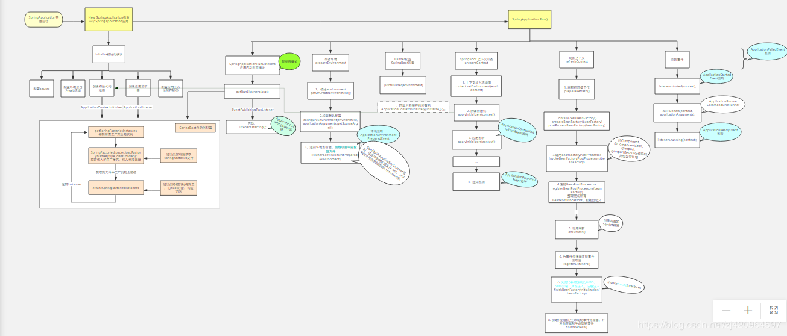

大图查看：

https://www.processon.com/view/link/5cb0562ee4b0bb527acc9be9

### 一、New SpringApplication（）
### 二、Run（）

第一部分New SpringApplication分析
直接从SpringApplication构造函数开始：

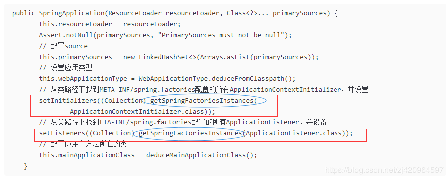

getSpringFactoriesInstances分析：

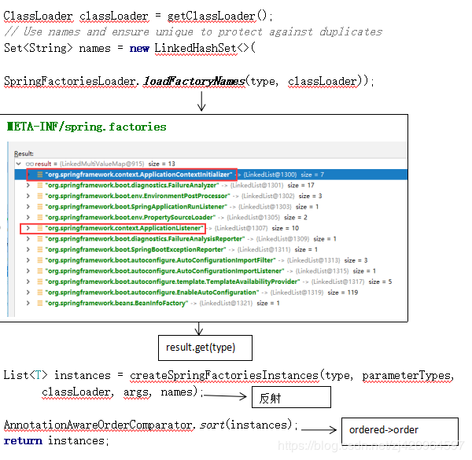

#### loadFactoryNames分析：

第一次启用时将META-INF/spring.factories的配置信息添加到result，并缓存起来

通过type（即META-INF/spring.factories的key）从result取出Set<String>

#### createSpringFactoriesInstances分析：

通过取出来的Set<String> names 进行反射，获取实例List<T>

#### AnnotationAwareOrderComparator.sort分析：

通过实现org.springframework.core.Ordered接口，重新getOrder方法，通过order值可进行排序，使得调用顺序不同

#### deduceMainApplicationClass()分析：

    private Class<?> deduceMainApplicationClass() {
            try {
                StackTraceElement[] stackTrace = new RuntimeException().getStackTrace();
                for (StackTraceElement stackTraceElement : stackTrace) {
                    if ("main".equals(stackTraceElement.getMethodName())) {
                        return Class.forName(stackTraceElement.getClassName());
                    }
                }
            }
            catch (ClassNotFoundException ex) {
                // Swallow and continue
            }
            return null;
        }
通过堆栈中获取方法名为main的信息，找到当前类并返回

### 第二部分Run（）分析
    public ConfigurableApplicationContext run(String... args) {
        // 开始起止的监听
        StopWatch stopWatch = new StopWatch();
        stopWatch.start();
        // 声明IOC容器
        ConfigurableApplicationContext context = null;
        Collection<SpringBootExceptionReporter> exceptionReporters = new ArrayList<>();
        // awt 相关，省略
        configureHeadlessProperty();
        // 得到一个org.springframework.boot.context.event.EventPublishingRunListener
        SpringApplicationRunListeners listeners = getRunListeners(args);
        //回调所有的获取SpringApplicationRunListener.starting()方法
        // 启动ApplicationStartingEvent监听
        listeners.starting();
        try {
            // 封装命令行参数
            ApplicationArguments applicationArguments = new DefaultApplicationArguments(
                    args);
            // 准备环境
            ConfigurableEnvironment environment = prepareEnvironment(listeners,
                    applicationArguments);
            configureIgnoreBeanInfo(environment);
            // 控制台打印Spring banner图标
            Banner printedBanner = printBanner(environment);
            // 创建ApplicationContext；决定创建web的ioc还是普通的ioc
            context = createApplicationContext();
            exceptionReporters = getSpringFactoriesInstances(
                    SpringBootExceptionReporter.class,
                    new Class[] { ConfigurableApplicationContext.class }, context);
            // 准备上下文环境;将environment保存到ioc中；
            // applyInitializers()：回调之前保存的所有的ApplicationContextInitializer的initialize方法
            // 回调所有的SpringApplicationRunListener的contextPrepared()
            // prepareContext运行完成以后回调所有的SpringApplicationRunListener的contextLoaded()
            prepareContext(context, environment, listeners, applicationArguments,
                    printedBanner);
            // 刷新容器；ioc容器初始化（如果是web应用还会创建嵌入式的Tomcat）；Spring注解版
            // 扫描，创建，加载所有组件的地方；（配置类，组件，自动配置）
            refreshContext(context);
            afterRefresh(context, applicationArguments);
            stopWatch.stop();
            if (this.logStartupInfo) {
                new StartupInfoLogger(this.mainApplicationClass)
                        .logStarted(getApplicationLog(), stopWatch);
            }
            listeners.started(context);
            callRunners(context, applicationArguments);
        }
        catch (Throwable ex) {
            handleRunFailure(context, ex, exceptionReporters, listeners);
            throw new IllegalStateException(ex);
        }

        try {
            listeners.running(context);
        }
        catch (Throwable ex) {
            handleRunFailure(context, ex, exceptionReporters, null);
            throw new IllegalStateException(ex);
        }
        return context;
    }
#### getRunListeners分析：

从result中读取key为：SpringApplicationRunListener的监听器，此次返回EventPublishingRunListener

#### listeners.starting()分析：

#### EventPublishingRunListener：启动事件发布监听器

    this.initialMulticaster.multicastEvent( new ApplicationStartingEvent(this.application, this.args));
    @Override
	public void multicastEvent(final ApplicationEvent event, @Nullable ResolvableType eventType) {
		ResolvableType type = (eventType != null ? eventType : resolveDefaultEventType(event));
		for (final ApplicationListener<?> listener : getApplicationListeners(event, type)) {
			//获取线程池，如果为空则同步处理。这里线程池为空，还未没初始化。
			Executor executor = getTaskExecutor();
			if (executor != null) {
			    //异步发送事件
				executor.execute(() -> invokeListener(listener, event));
			}
			else {
				//同步发送事件
				invokeListener(listener, event);
			}
		}
	}
#### prepareEnvironment分析：

    private ConfigurableEnvironment prepareEnvironment(
            SpringApplicationRunListeners listeners,
            ApplicationArguments applicationArguments) {
        // Create and configure the environment
        //1、初始化environment
        ConfigurableEnvironment environment = getOrCreateEnvironment();
        //2、加载默认配置
        configureEnvironment(environment, applicationArguments.getSourceArgs());
        //3、通知环境监听器，加载项目中的配置文件
        listeners.environmentPrepared(environment);
        bindToSpringApplication(environment);
        if (!this.isCustomEnvironment) {
            environment = new EnvironmentConverter(getClassLoader())
                    .convertEnvironmentIfNecessary(environment, deduceEnvironmentClass());
        }
        ConfigurationPropertySources.attach(environment);
        return environment;
    }
#### listeners.environmentPrepared(environment)分析：
 1.通知环境监听器进行监听

    ApplicationEnvironmentPreparedEvent
    this.initialMulticaster.multicastEvent(new ApplicationEnvironmentPreparedEvent(
          this.application, this.args, environment));
 2.加载项目中的配置文件

如进行加载：application.yml application.properties  application-mybatis.yml 等

加载 application-mybatis.yml时，需要在application.yml中进行如下配置

spring.profiles.active = mybatis
ctrl+左键点击spring.profiles.active  进入到 ConfigFileApplicationListener监听，该监听即将配置文件.xml、.yml中的文件信息加载到enviroment中。

调用链为：

ConfigFileApplicationListener的Loader下load()方法，然后进入addLoadedPropertySources()进行将配置信息绑定到environment的propertysources中

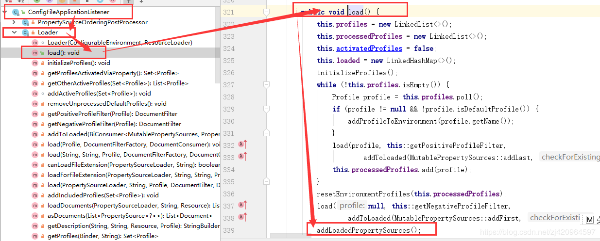

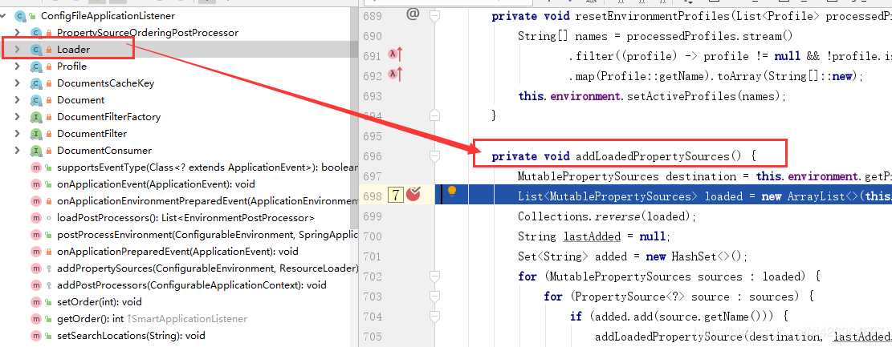
#### printBanner分析：
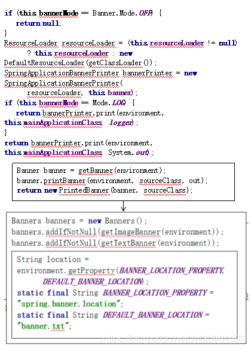

可resource/banner.txt自定义banner信息，或者配置文件中配置spring.banner.location中配置路径

#### prepareContext分析：
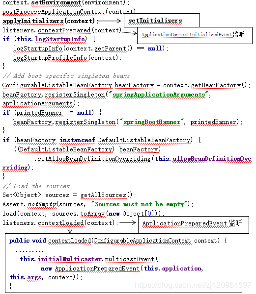

#### refreshContext(context)分析：
    class AbstractApplicationContext
    ......
    @Override
    public void refresh() throws BeansException, IllegalStateException {
       synchronized (this.startupShutdownMonitor) {//refresh过程只能一个线程处理，不允许并发执行
          // 刷新前准备工作
          prepareRefresh();
          // 调用子类refreshBeanFactory()方法，获取bean factory
          ConfigurableListableBeanFactory beanFactory = obtainFreshBeanFactory();
          // 创建bean Factory的通用设置，添加ApplicationContextAwareProcessor,
          // ResourceLoader、ApplicationEventPublisher、ApplicationContext这3个接口对应的bean都设置为当前的Spring容器,注册环境bean
          prepareBeanFactory(beanFactory);
          try {
             // 子类特殊的bean factory设置
             // GenericWebApplicationContext容器会在BeanFactory中添加ServletContextAwareProcessor用于处理ServletContextAware类型的bean初始化的时候调用setServletContext或者setServletConfig方法
             postProcessBeanFactory(beanFactory);
             // 实例化beanFactoryPostProcessor
             // 调用beanFactoryPostProcessor 这里会调用ConfigurationClassPostProcessor，解析@Configuration的类为BeanDefinition，为后面实例化作准备
             invokeBeanFactoryPostProcessors(beanFactory);
             // 注册 beanPostProcessors 包括自定义的BeanPostProcessor
             // 在实例化Bean后处理 比如AutowiredAnnotationBeanPostProcessor(处理被@Autowired注解修饰的bean并注入)、RequiredAnnotationBeanPostProcessor(处理被@Required注解修饰的方法)
             // 这些都是在创建Context时的reader的构造器中的AnnotationConfigUtils的registerAnnotationConfigProcessors方法中注册的
             registerBeanPostProcessors(beanFactory);
             // 初始化信息源，和国际化相关
             initMessageSource();
             // 初始化容器事件传播器
             initApplicationEventMulticaster();
             // 调用子类特殊的刷新逻辑
             // web程序的容器AnnotationConfigEmbeddedWebApplicationContext中会调用createEmbeddedServletContainer方法
            //去创建内置的Servlet容器，目前只支持三种 tomcat，jetty，undertow
             onRefresh();
             // 为事件传播器注册事件监听器
             registerListeners();
             //实例化非懒加载的bean、bean封装、属性注入、注解注入(主要使用BeanPostProcessor或子类实现)等
             finishBeanFactoryInitialization(beanFactory);
             // 初始化容器的生命周期事件处理器，并发布容器的生命周期事件
             finishRefresh();
          }
          catch (BeansException ex) {
             // ...
          }
          finally {
             // ...
          }
       }
    }

- preparePefresh（）分析：

刷新前的准备：设置spring容器的启动时间，撤销关闭状态、开启活跃状态、在上下文环境中初始化任何占位符属性源、environment的all properties验证所有标记为“必需”的属性是否可解析

- obtainFreshBeanFactory()分析：

    1.调用子类的refeshBeanFactory(),SpringBoot中采用默认的实现，设置BeanFactory的SerializationId,设置refreshed标志为true。

    2.获取BeanFactory

    3.XmlWebApplicationContext ，AnnotationConfigApplicationContext 会在这一步加载BeanDefinition

- prepareBeanFactory(beanFactory)分析：

- postProcessBeanFactory(beanFactory)分析：

- invokeBeanFactoryPostProcessors(beanFactory)分析：

AutoConfigurationImportSelector类的process()将装载完成的自动配置类存入autoConfigurationEntries属性，然后调用
Iterable<Entry> selectImports()方法，确定需要导入的自动配置类并进行排序
ConfigurationClassParser类进行解析，
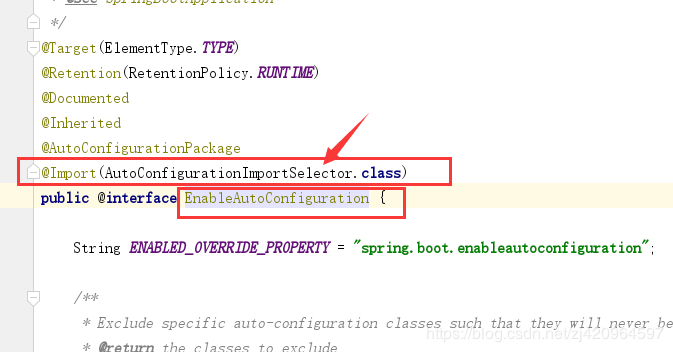

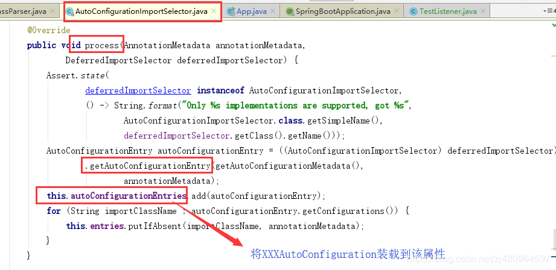

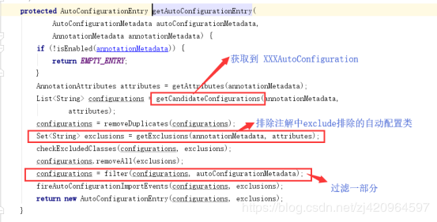

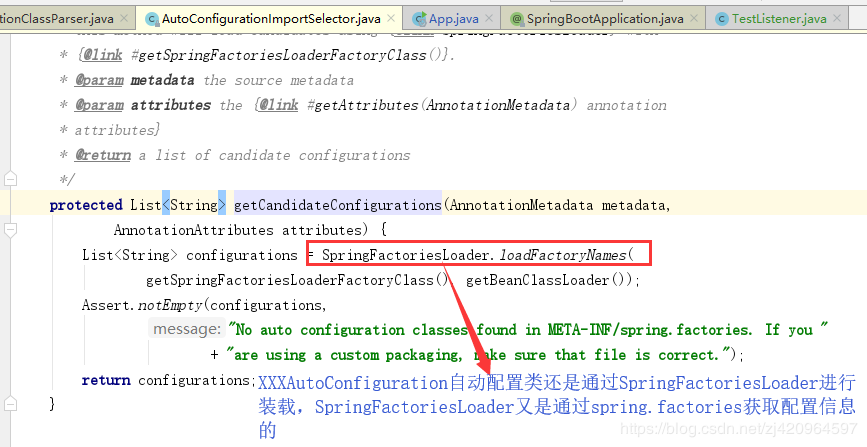

继而进入AutoConfigurationImportSelector类的Iterable<Entry> selectImports()方法，springboot 2.1后不再进入

String[] selectImports

- 总结：

invokeBeanFactoryPostProcessors方法总结来说就是从Spring容器中找出BeanDefinitionRegistryPostProcessor和BeanFactoryPostProcessor接口的实现类并按照一定的规则顺序进行执行。 其中ConfigurationClassPostProcessor这个BeanDefinitionRegistryPostProcessor优先级最高，它会对项目中的@Configuration注解修饰的类(@Component、@ComponentScan、@Import、@ImportResource修饰的类也会被处理)进行解析，解析完成之后把这些bean注册到BeanFactory中。需要注意的是这个时候注册进来的bean还没有实例化。

- registerBeanPostProcessors(beanFactory)分析：

- onRefresh()分析：

一个模板方法，不同的Spring容器做不同的事情。

比如web程序的容器AnnotationConfigEmbeddedWebApplicationContext中会调用createEmbeddedServletContainer方法去创建内置的Servlet容器。

目前SpringBoot只支持3种内置的Servlet容器：

    Tomcat
    Jetty
    Undertow
- finishBeanFactoryInitialization(beanFactory)分析：

1. 实例化非懒加载的bean、bean封装、属性注入、注解注入(主要使用BeanPostProcessor或子类实现)等

2. invokeAwareInterfaces

bean实例化完成后会调用ApplicationContextAwareProcessor类的invokeAwareInterfaces方法

- finishRefresh分析：

    1.完成容器的初始化过程,发布相应事件。

    2.启动容器的声明周期处理器。管理容器声明周期。
    
    3.发布 ContextRefreshedEvent事件。
    
    4.启动内嵌的Servlet容器。
    
    5.发布容器启动事件。

