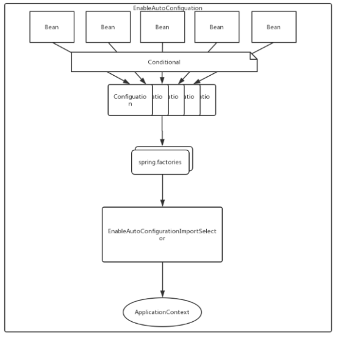
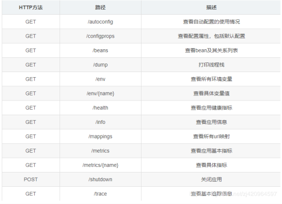

#Springboot
###一、Spring Boot入门

####1.Spring Boot 的背景：
在 Java 后端框架繁荣的今天，Spring 框架无疑是最最火热，也是必不可少的开源框架，更是稳坐 Java 后端框架的龙头老大。
用过 Spring 框架的都知道 Spring 能流行是因为它的两把利器：IOC 和 AOP，IOC 可以帮助我们管理对象的依赖关系，极大减少对象的耦合性，而 AOP 的切面编程功能可以更方面的使用动态代理来实现各种动态方法功能（如事务、缓存、日志等）。
而要集成 Spring 框架，必须要用到 XML 配置文件，或者注解式的 Java 代码配置。无论是使用 XML 或者代码配置方式，都需要对相关组件的配置有足够的了解，然后再编写大量冗长的配置代码。
Spring Boot来简化Spring应用开发，约定大于配置，去繁从简，just run就能创建一个独立的，产品级别的应用。

####2.什么是 Spring Boot?
Spring Boot是 Spring 开源组织下的一个子项目，也是 Spring 组件一站式解决方案，主要是为了简化使用 Spring 框架的难度，简省繁重的配置。
Spring Boot提供了各种组件的启动器（starters），开发者只要能配置好对应组件参数，Spring Boot 就会自动配置，让开发者能快速搭建依赖于 Spring 组件的 Java 项目。
Spring Boot不但能创建传统的 war 包应用，还能创建独立的不依赖于任何外部容器（如：tomcat）的独立应用，使用 java -jar 命令就能启动。同时，Spring Boot也提供了一个命令行工具来执行 Spring 的脚本。

Spring Boot 的官方网站：

https://projects.spring.io/spring-boot/

Spring Boot 官方文档：

https://docs.spring.io/spring-boot/docs/current/reference/html/

Spring Boot 的源码：

https://github.com/spring-projects/spring-boot

####3.Spring Boot 的设计目标
- 为 Spring 应用开发提供一个更快、更容易上手的入门体验；
- 提供一系列在大型项目中经常用到的公共的非功能性特性，如：内嵌入服务器、安全、度量指标、健康检测、外部化配置；
- 零代码配置生成及零 XML 配置；

####4.Spring Boot 的优点
- 快速创建独立运行的Spring项目以及与主流框架集成
- 使用嵌入式的Servlet容器，应用无需打成WAR包
- starters自动依赖与版本控制
- 大量的自动配置，简化开发，也可修改默认值
- 无需配置XML，无代码生成，开箱即用
- 准生产环境的运行时应用监控

###二、Spring Boot配置
####1.配置文件

application.properties(常用)

application.yml(常用)

application.yaml

application.xml

####2.加载顺序
优先级从低到高：

classpath:/

classpath:/config/

file:./

file:./config/

优先级由高到低，对于相同的属性配置，高优先级的配置会覆盖优先级低的配置；对于其他不同的属性配置，则会进行互补。

优先级相同的情况下，同时有application.properties和application.yml，那么application.properties里面的属性就会覆盖application.yml里的属性，因为properties比yml优先加载

我们也可以通过配置spring.config.location来改变默认配置

### 三、Springboot自动配置
#### 1.什么是自动配置
自动装配利用了SpringFactoriesLoader来加载META-INF/spring.factoires文件里所有配置的EnableAutoConfigruation，它会经过exclude和filter等操作，最终确定要装配的配置类，并装载到ioc容器。
#### 2.自动配置实现原理
自动配置-设计基础：

Spring4.0引入的新特性--条件化配置。条件化配置允许配置存在于应用程序中，但在满足某些特定条件之前都忽略这些配置。

1. 使用@EnableAutoConfiguration注解，会启用自动配置

2. 该注解导入了EnableAutoConfigurationImportSelector，其selectImports方法

3. 其通过getCandidateConfigurations 方法，获取配置文件列表：
loadFactoryNames会加载所有META-INF下有spring.factories文件的jar包，并根据spring.factories文件中的配置，去加载相应的类。

流程：

- @Configuration 配置的Bean -> 
- BeanFactory -> 
- ImportSelector -> 
- AutoConfigurationSelectImporter->
- SpringFactoriesLoader-> 
- META-INF/spring.factories->
- 所有配置了EnableAutoConfiguration -> 
- @Configuration ->
- 收集好后注册到IOC容器里

#### 3.何时自动配置
refresh方法里的invokeBeanFactoryPostProcessors(beanFactory)方法时会执行自动装配

### 四、Spring Boot与监控管理
Spring Boot的众多Starter POMs中有一个特殊的模块，它不同于其他模块那样大多用于开发业务功能或是连接一些其他外部资源。它完全是一个用于暴露自身信息的模块，所以很明显，它的主要作用是用于监控与管理，它就是：spring-boot-starter-actuator。

根据端点的作用来说，我们可以原生端点分为三大类：
- 应用配置类：获取应用程序中加载的应用配置、环境变量、自动化配置报告等与Spring Boot应用密切相关的配置类信息。
- 度量指标类：获取应用程序运行过程中用于监控的度量指标，比如：内存信息、线程池信息、HTTP请求统计等。
- 操作控制类：提供了对应用的关闭等操作类功能。
路径参考：

### 五、Spring Boot自定义starters 
启动器（starter）

Starter 组件是可被加载在应用中的 Maven 依赖项。Spring Boot 提供了很多 “**开箱即用**” 的 Starter 组件。只需要在 Maven 配置中添加对应的依赖配置，即可使用对应的 Starter 组件。
开发中，很多功能是通过添加 Starter 组件的方式来进行实现。下面都是常用的组件，还有很多事务、消息、安全、监控、大数据等支持。

启动器模块是一个空 JAR 文件，仅提供辅助性依赖管理，这些依赖可能用于自动装配或者其他类库

命名规约：

推荐使用以下命名规约；

- 官方命名空间

前缀：“spring-boot-starter-” 

模式：spring-boot-starter-模块名

举例：spring-boot-starter-web、spring-boot-starter-actuator、spring-boot-starter-jdbc

- 自定义命名空间

后缀：“-spring-boot-starter” 

模式：模块-spring-boot-starter

举例：mybatis-spring-boot-starter

### 六、Spring Boot启动源码分析

